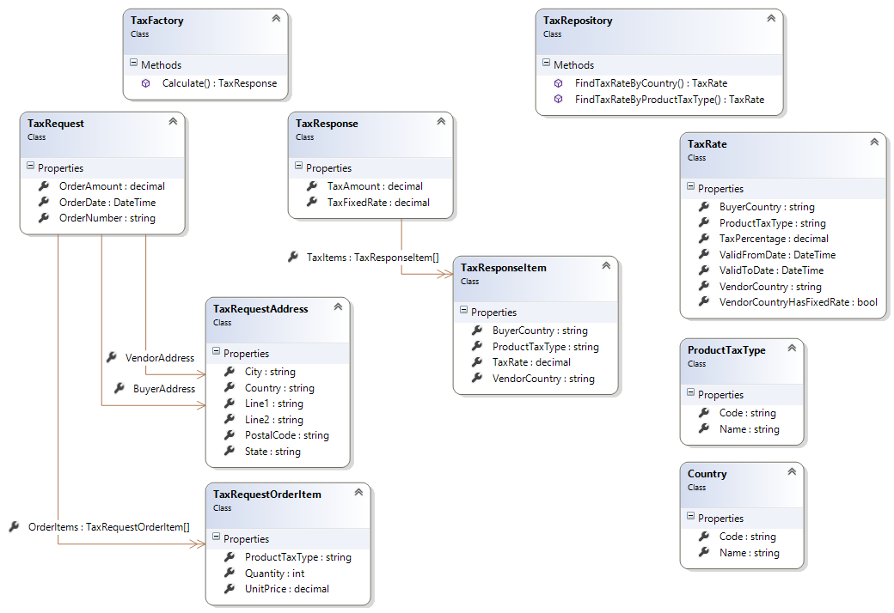

Multi-Country Tax Calculator
============================

Statement
---------

* A company processes orders that are placed in multiple countries.
	* Calculate country taxes.
* Some may use:
	* A simple calculation
	* A fixed percentage
* others:
	* Use a sophisticated formula 
	* Requires additional information
		* Product classification
		* Vendor location
		* Buyer location 
		* Etc.

Problem
-------

Propose a model (class model) that:

* Can be used to calculate taxes for multiple countries 
* Can be escalated easily. 

**NOTICE**: made up objects may be included.

Solution
========

Proposed model is shown below.

Class Model
-----------

Entities
--------

